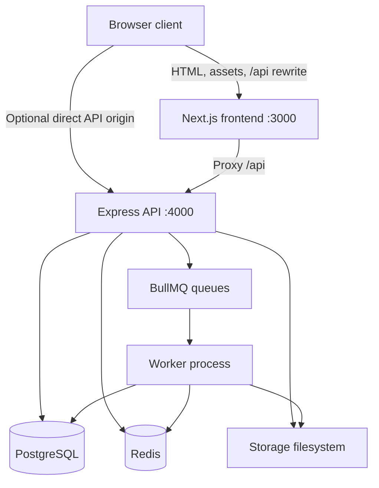
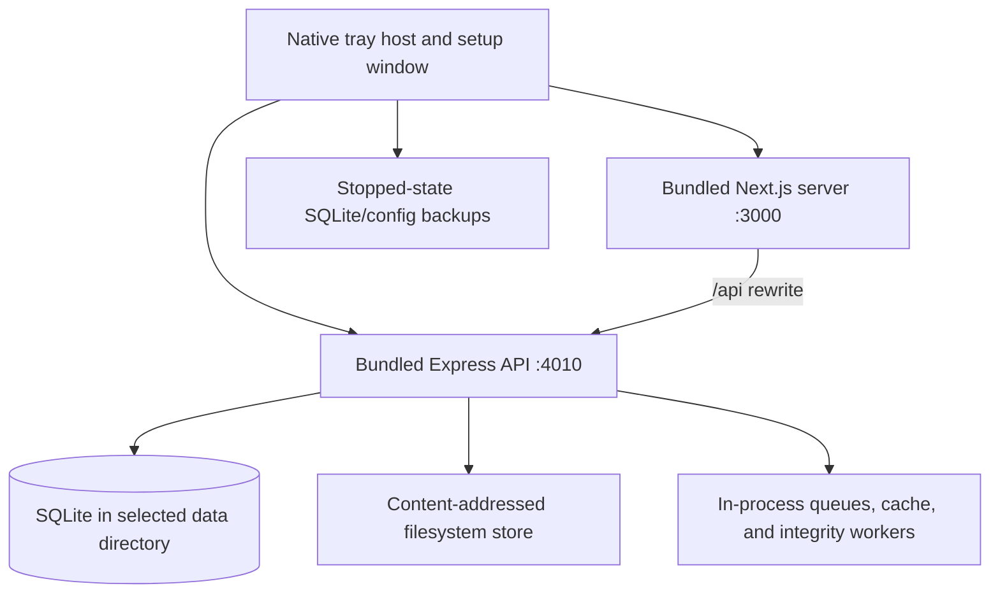
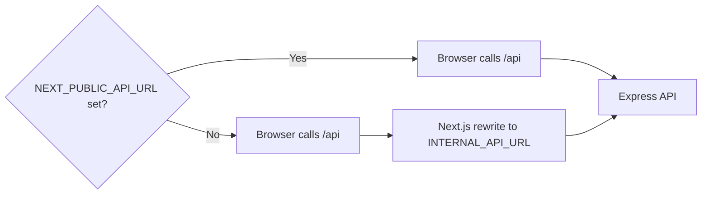
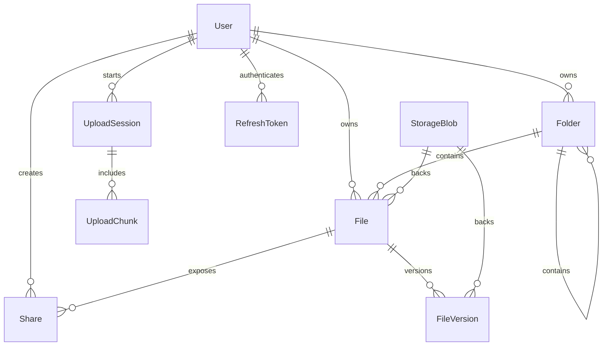
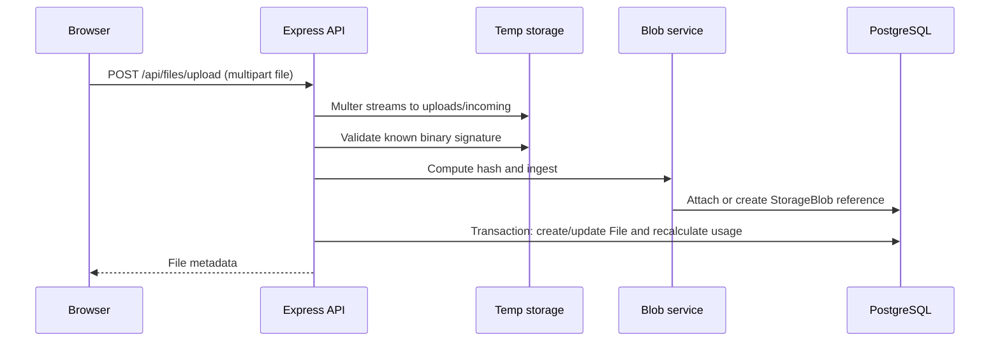
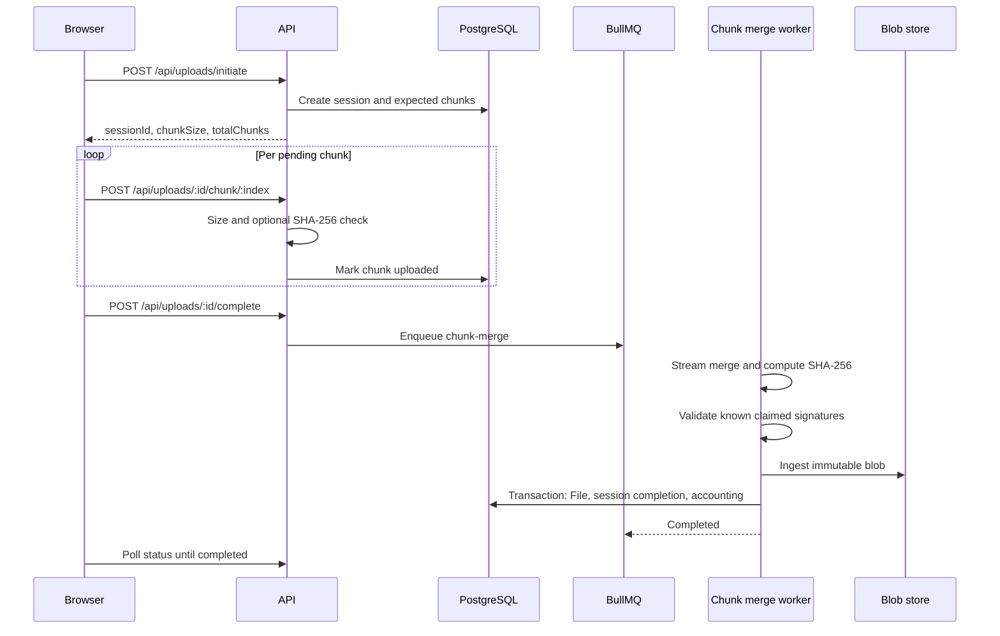

# NexxCloud Architecture

This document describes the implemented NexxCloud system: its processes, data model,
filesystem invariants, upload pipeline, integrity workers, authentication boundary, and
deployment shape. It is written for contributors changing data ownership or failure
behavior, where an apparently small change can affect persisted files.

## Contents

- [System Context](#system-context)
- [Repository Layout](#repository-layout)
- [Runtime Topology](#runtime-topology)
- [Native Server Topology](#native-server-topology)
- [Backend Modules](#backend-modules)
- [Frontend Modules](#frontend-modules)
- [Data Model](#data-model)
- [Storage Engine](#storage-engine)
- [Upload Pipelines](#upload-pipelines)
- [File and Folder Mutations](#file-and-folder-mutations)
- [Versions and Sharing](#versions-and-sharing)
- [Media Delivery and Authentication](#media-delivery-and-authentication)
- [Workers and Integrity Repair](#workers-and-integrity-repair)
- [Realtime Infrastructure](#realtime-infrastructure)
- [LAN and Reverse Proxy Behavior](#lan-and-reverse-proxy-behavior)
- [Operational Invariants](#operational-invariants)
- [Known Boundaries](#known-boundaries)

## System Context

NexxCloud is a self-hosted web application whose authoritative metadata is held in
PostgreSQL for Docker deployments or SQLite for native server installations. Binary
payloads are held in the same content-addressed filesystem store in both modes.
The frontend never needs to know physical blob paths. It operates through authenticated
REST operations and expiring media URLs.



The core reliability boundary is the combination of a relational transaction and
post-commit filesystem cleanup:

- Metadata changes and reference-count mutations are transacted in PostgreSQL.
- A physical blob is deleted only after its final database reference has been removed.
- Failed new-file transactions compensate by releasing a just-ingested blob.
- Accounting totals can always be recalculated from `File` state.

## Repository Layout

```text
NexxCloud/
|-- backend/
|   |-- prisma/
|   |   |-- schema.prisma
|   |   `-- migrations/
|   |-- src/
|   |   |-- controllers/
|   |   |-- events/
|   |   |-- lib/
|   |   |-- middleware/
|   |   |-- repositories/
|   |   |-- routes/
|   |   |-- services/
|   |   |-- validators/
|   |   |-- websocket/
|   |   |-- workers/
|   |   |-- server.ts
|   |   `-- worker.ts
|   `-- tests/
|-- frontend/
|   |-- public/media/
|   `-- src/
|       |-- app/
|       |-- components/
|       |-- hooks/
|       |-- lib/
|       `-- store/
|-- native/                     # Electron server host and native packaging
|   |-- src/                    # tray, startup, runtime supervision, backups
|   |-- scripts/                # native runtime staging
|   `-- ui/                     # first-run/control panel
|-- data/                       # bind-mounted application data
|-- deploy/                     # HTTPS/proxy deployment examples
|-- docker-compose.yml
|-- setup.sh / setup.ps1        # secure first-install launchers
|-- start.sh / start.ps1        # validated repeat launchers
|-- update.sh                   # backup-first Linux update launcher
`-- .env.example
```

## Runtime Topology

Docker Compose provisions five runtime services:

| Service    | Image/runtime            | Published port        | Durable resources        | Role                                                                               |
| ---------- | ------------------------ | --------------------- | ------------------------ | ---------------------------------------------------------------------------------- |
| `frontend` | Node 22, Next standalone | `${FRONTEND_PORT}:3000` | None                     | Web application, frontend health endpoint, and `/api` reverse proxy.               |
| `backend`  | Node 20, Express         | `${BACKEND_PORT}:4000`  | `${NEXXCLOUD_DATA_DIR}`   | REST API, secure streaming, readiness checks, queue dashboard, mDNS, WebSockets.   |
| `worker`   | Same backend image       | None                  | `${NEXXCLOUD_DATA_DIR}`   | BullMQ consumers and scheduled integrity jobs; waits for healthy backend startup.  |
| `postgres` | PostgreSQL 16 Alpine     | Not host-published    | `${COMPOSE_PROJECT_NAME}_postgres_data` | Transactional metadata; internal data network only.                  |
| `redis`    | Redis 7 Alpine           | Not host-published    | `${COMPOSE_PROJECT_NAME}_redis_data`    | Queues and event transport; internal data network only.               |

On backend container startup, Compose executes:

```bash
sh ./scripts/deploy-migrations.sh && npm start
```

Fresh databases use standard Prisma migration deployment. If Prisma reports `P3005`
for an installation created by the earlier schema-push startup, the launcher applies
and records the committed additive baseline and blob migration only after recognizing
legacy NexxCloud core tables, then resumes normal
`prisma migrate deploy` processing. Startup refuses weak production secrets, waits on
PostgreSQL and Redis health, verifies writable storage, and exposes readiness at
`/health/ready` only after dependencies respond.

## Native Server Topology

The native host exists beside Compose rather than replacing it. It bundles the production
Next.js standalone server and compiled Express backend into an Electron tray application
packaged through NSIS on Windows and AppImage, DEB, or RPM on Linux.



| Native concern | Implementation |
| -------------- | -------------- |
| First-run setup | Select data directory and UI port; cryptographic signing secrets are generated locally. |
| Database | SQLite under `database/nexxcloud.db`; transactional SQL migrations are applied once through a local ledger. |
| Background work | The existing workers run inside the API process through a local queue adapter, with no Redis dependency. |
| Startup | Electron login startup integration launches a background tray process after sign-in. |
| Control plane | Tray/menu window opens the dashboard, restarts or stops services, opens logs/data, toggles startup, and creates backups. |
| Network | The frontend binds `0.0.0.0` for LAN access; the internal API remains proxied through the browser-facing UI. |

Native installs maintain this local layout:

```text
SelectedDataDirectory/
|-- uploads/ blobs/ previews/ thumbnails/ temp/ tmp/
|-- logs/
|-- database/nexxcloud.db
|-- database/.migrations/
`-- backups/
```

The native readiness probe performs a real application-table query, so a malformed or
uninitialized SQLite file cannot be reported as a running server.

## Backend Modules

### HTTP Composition

`backend/src/server.ts` creates the Express process and owns:

- Helmet response hardening with streaming-friendly cross-origin media configuration.
- Dynamic CORS acceptance for the configured frontend origin, local loopback, `.local`,
  `.home`, `.lan`, and private IPv4 LAN origins.
- JSON parsing with BigInt serialization and a 10 MiB JSON body limit.
- Global and authentication-specific rate limits.
- Basic-auth protected Bull Board at `/admin/queues`.
- Storage directory initialization and startup integrity job enqueuing.
- API routers under `/api/*`, plus authenticated legacy media routes under `/files/*`.
- WebSocket upgrade handling and mDNS service publication.

### Domain Services

| Service                    | Ownership                                                                                    |
| -------------------------- | -------------------------------------------------------------------------------------------- |
| `authService`              | User registration, password hashing, access/refresh JWT issue and refresh-token persistence. |
| `fileService`              | Create, replace, copy, move, trash, restore, delete, favorites, and file listing logic.      |
| `folderService`            | Logical folder tree operations and recursive state changes.                                  |
| `storageBlobService`       | SHA-256 blob ingestion, reference increments/releases, physical blob deletion.               |
| `storageAccountingService` | Recalculation, verification, and repair of user storage/trash totals.                        |
| `storageService`           | Safe paths, directory layout, disk statistics, and storage cache invalidation.               |
| `uploadService`            | Chunk session creation, part acceptance, session completion, resume and cancellation.        |
| `versionService`           | File snapshots, restoration, version deletion, and retention queueing.                       |
| `mediaAccessService`       | Short-lived signed tokens for media URLs.                                                    |
| `shareService`             | Public share tokens, optional password checks, and expiration.                               |
| `thumbnailService`         | Image, video, and PDF derived preview production.                                            |
| `fileTypeService`          | File categorization, signature checks, and dangerous-type identification.                    |
| `mdnsService`              | Local discovery publication for web and API endpoints.                                       |

### Repositories

Repositories wrap Prisma queries for users, files, folders, shares, permissions, uploads,
versions, and storage blobs. Domain mutation safety belongs in services because a storage
mutation generally requires more than a single repository operation.

## Frontend Modules

The frontend is a Next.js App Router application:

| Area                 | Implementation                                                                                                                                                                        |
| -------------------- | ------------------------------------------------------------------------------------------------------------------------------------------------------------------------------------- |
| Networking           | `src/lib/api.ts` provides one Axios client, derives an API base from `NEXT_PUBLIC_API_URL`, injects Bearer tokens, queues 401 retries during refresh, and resolves signed media URLs. |
| Public access        | `src/lib/publicApi.ts` handles public share display and media/download URLs.                                                                                                          |
| Authentication state | Persisted Zustand state in `authStore.ts` holds user and token state and restores sessions on hydration.                                                                              |
| File explorer state  | `fileStore.ts` manages files, folders, breadcrumbs, selection, navigation history, actions, and optimistic UI updates.                                                                |
| Upload state         | `uploadStore.ts` and `chunkedUpload.ts` select direct or chunked delivery, track progress, retry individual chunks, poll merges, and reconcile interrupted queues.                    |
| Application screens  | Landing page, sign-in, registration, file explorer/dashboard, settings, and public share view.                                                                                        |
| Design language      | Dark canvas, restrained hairline borders, glass surfaces, cyan/violet highlights, monospace metadata, Lucide controls, and Framer Motion landing depth.                               |

### API Origin Strategy



The Compose frontend intentionally exposes an empty `NEXT_PUBLIC_API_URL`, causing browser
requests to stay same-origin at `/api`; the Next.js server forwards those calls to
`http://backend:4000`. Manual development sets a visible API origin.

## Data Model

### Primary Relationships



### Important Tables

| Model                                                                      | Purpose and key constraints                                                                                                                                                 |
| -------------------------------------------------------------------------- | --------------------------------------------------------------------------------------------------------------------------------------------------------------------------- |
| `User`                                                                     | Identity plus `storageUsed`, `trashSize`, and `storageQuota` accounting fields. Username and email are unique.                                                              |
| `StorageBlob`                                                              | Physical object metadata: unique `hash`, unique `physicalPath`, size, and `referenceCount`.                                                                                 |
| `File`                                                                     | User-visible metadata and current `blobId`. `storedName` remains unique metadata, while `path` targets the shared blob. Blob deletion is restricted while references exist. |
| `FileVersion`                                                              | Historic file metadata with independent blob reference. Version numbers are unique within each file.                                                                        |
| `Folder`                                                                   | Metadata-only hierarchy using parent references and unique sibling names per user.                                                                                          |
| `UploadSession` / `UploadChunk`                                            | Resumable transfer state and per-index staged paths/hashes. A chunk index is unique within its session.                                                                     |
| `RefreshToken`                                                             | Server-persisted refresh token lifecycle with cascade removal when the user is removed.                                                                                     |
| `Share`                                                                    | Unique public token with optional password hash and expiration fields.                                                                                                      |
| `Permission`, `ActivityLog`, `EventLog`, `Notification`, `SyncPreparation` | Data structures available for authorization/activity/event evolution. Not every model currently has a public route or active producer.                                      |

### Logical Versus Physical Size

NexxCloud accounts storage at the file metadata level:

```text
storageUsed = SUM(File.size WHERE userId = ? AND deletedAt IS NULL)
trashSize   = SUM(File.size WHERE userId = ? AND deletedAt IS NOT NULL)
```

This means:

- Two logical copies backed by one blob each contribute their file size to logical usage.
- Deduplication reduces physical disk occupation, not logical ownership/accounting.
- Trash moves size from active usage to trash usage through recalculation.
- Blob and version references are independent of the active/trash accounting fields.

## Storage Engine

### Directory Layout

`storageService` resolves and creates the following structures:

```text
<STORAGE_ROOT>/
|-- blobs/<sha256[0:2]>/<sha256>
|-- tmp/
`-- <userId>/
    |-- files/
    |-- thumbnails/
    |-- uploads/
    |   |-- incoming/
    |   |-- chunks-tmp/
    |   `-- chunks/<sessionId>/<index>.chunk
    `-- versions/
```

The `files/` and `versions/` user directories remain for compatibility paths and derived
operations; newly ingested content resolves to the shared `blobs/` object tree.

### Blob Invariants

For each `StorageBlob`:

1. `hash` is the SHA-256 digest of the physical binary.
2. `physicalPath` resolves beneath the global storage root.
3. `referenceCount` should equal `File` references plus `FileVersion` references.
4. A referenced blob must not be removed.
5. A blob at zero references may be deleted from PostgreSQL and then from disk.

### Ingestion Algorithm

`storageBlobService.ingestFile()` performs the content-addressed step:

1. Stream a SHA-256 digest unless the trusted caller already generated it during merge.
2. Search `StorageBlob` by digest.
3. When found, increment its reference count and remove the temporary candidate.
4. When absent, move or copy the temporary candidate into its digest path and insert a
   blob row.
5. Recover from a unique-hash race by attaching to the winner and removing duplicate bytes.

File creation then runs a metadata transaction. If it fails, the newly attached reference
is released and an unneeded physical blob is removed after that compensating transaction.

## Upload Pipelines

### Direct Multipart Pipeline



The upload middleware enforces `MAX_FILE_SIZE` and creates files on disk rather than
buffering them in process memory. File extensions are metadata rather than an allowlist:
custom formats and executable payloads may be stored as opaque objects. Known claimed
preview formats still pass binary signature checks, and risky content is sandboxed when
delivered.

### Chunk Session Pipeline



### Recovery and Cleanup

- The server exposes session status and resume information.
- The frontend persists transfer metadata but cannot persist browser `File` objects;
  an interrupted page instance therefore cancels stale in-progress UI tasks on recovery.
- The chunk cleanup worker removes registered chunks and abandoned `chunks-tmp` files
  older than 24 hours, then marks eligible sessions cancelled.
- Merge jobs refuse completed/cancelled sessions and fail if a required chunk is absent.

## File and Folder Mutations

### File Operations

| Operation                  | Metadata action                                            | Blob/accounting action                                                                        |
| -------------------------- | ---------------------------------------------------------- | --------------------------------------------------------------------------------------------- |
| New file                   | Create `File` pointing to ingested `StorageBlob`.          | Add blob reference; recalculate usage.                                                        |
| Same-name upload in folder | Create a prior-current version and update existing `File`. | Reference new blob, release replaced current reference, recalculate.                          |
| Copy/duplicate             | Create another `File` with independent metadata.           | Increment existing blob reference; recalculate logical usage.                                 |
| Move/rename/favorite       | Update file metadata.                                      | No binary move.                                                                               |
| Trash/restore              | Toggle `deletedAt`.                                        | Transactionally recalculate active/trash totals.                                              |
| Permanent delete           | Delete file and associated versions.                       | Release every blob reference; delete unreferenced physical objects after commit; recalculate. |

### Folder Operations

Folders are logical nodes. Recursive trash and restore gather descendant folder IDs and
apply `deletedAt` to contained files/folders in a transaction before recalculating the
affected user's totals. Recursive permanent deletion releases every file/version blob
reference before removing physical objects after the transaction.

Folder copy recursively creates metadata and increments referenced blobs. Because recursive
copy progresses through child/file operations, contributors changing it should add failure
tests around partial-copy behavior.

## Versions and Sharing

### Versions

A `FileVersion` points to a blob just like a current file:

- Creating a version of a blob-backed file increments that blob reference.
- Restoring a version snapshots the current file first, switches the current blob
  reference in a transaction, and releases the superseded current reference.
- Removing a version releases its reference and physically removes a blob only when no
  file or version still uses it.
- A retention worker removes versions beyond `MAX_VERSIONS_PER_FILE`.

### Public Shares

`Share` records associate a secure random token with a file and may store:

- a bcrypt password hash,
- an expiration time,
- view and future policy fields.

The public controller returns file metadata and streams or downloads the file after token,
expiration, and configured password checks. Public-share access is separate from signed
authenticated media access.

## Media Delivery and Authentication

### Authentication

- Passwords are hashed with bcrypt.
- Access tokens are short-lived JWTs signed with `JWT_SECRET`.
- Refresh tokens are JWTs signed with `JWT_REFRESH_SECRET` and also persisted in the
  database so logout and rotation can revoke server-held records.
- Protected REST routes accept Bearer tokens through the `Authorization` header.

### Signed Media URLs

HTML media elements cannot reliably send an `Authorization` header. The authenticated
frontend therefore asks:

```http
POST /api/media/sign
Authorization: Bearer <access-token>
Content-Type: application/json

{ "fileId": "<id>", "type": "stream" }
```

The API issues a five-minute token signed by `MEDIA_TOKEN_SECRET`; public access to
`GET /api/media/:token` verifies that capability and serves a stream, download, or
thumbnail. The response sets private caching for signed content and adds restrictive CSP
headers for content categories that could execute or embed active payloads.

## Workers and Integrity Repair

### Worker Set

| Worker                   | Responsibility                                                                | Trigger                                          |
| ------------------------ | ----------------------------------------------------------------------------- | ------------------------------------------------ |
| `thumbnail-generation`   | Create preview files for supported binary categories.                         | Enqueued after eligible finalized chunk uploads. |
| `chunk-merge`            | Merge staged parts, hash/validate final content, commit blob-backed metadata. | Upload completion.                               |
| `trash-cleanup`          | Purge trash items older than retention and release references.                | Daily cron.                                      |
| `file-hash`              | Compute hash for legacy file rows without one.                                | Metadata repair enqueue.                         |
| `dedup-processor`        | Attach legacy paths to content-addressed blobs.                               | File hash or metadata repair enqueue.            |
| `version-cleanup`        | Retain only configured recent versions.                                       | Version creation.                                |
| `storage-calc`           | Legacy/recalculation queue implementation for user totals.                    | Queue available.                                 |
| `storage-integrity`      | Verify and repair `storageUsed` and `trashSize`.                              | Startup and daily cron.                          |
| `reference-verification` | Set each blob count to actual file plus version references.                   | Startup and daily cron.                          |
| `metadata-repair`        | Correct blob-backed file path/hash/size and migrate legacy records.           | Startup and daily cron.                          |
| `orphan-blob-cleanup`    | Remove zero-reference blob rows and binaries.                                 | Daily cron.                                      |
| `chunk-cleanup`          | Remove stale/abandoned part files and cancel stale sessions.                  | Every 30 minutes.                                |

### Scheduled Jobs

| Time             | Job                          |
| ---------------- | ---------------------------- |
| 02:00 daily      | Trash cleanup                |
| 02:15 daily      | Storage accounting integrity |
| 02:30 daily      | Blob reference verification  |
| 02:45 daily      | Metadata repair              |
| 03:00 daily      | Orphan blob cleanup          |
| Every 30 minutes | Chunk cleanup                |

Startup also enqueues accounting, reference, and metadata integrity checks after storage
initialization verifies that the configured root is writable.

## Realtime Infrastructure

NexxCloud includes:

- a WebSocket upgrade server on `/ws`,
- connection heartbeat/presence logic,
- Redis user-channel subscription support,
- an event emitter layer capable of writing activity and notification records and
  broadcasting synchronization events.

The current file/folder/upload mutation paths do not call that event emitter. The
infrastructure is therefore a foundation, not an end-to-end guarantee that changes made
in one browser instance appear in another without a refresh.

The WebSocket server currently supports a query token path and an attempted subprotocol
path. Query-string authentication is unsuitable for exposed deployments because URLs can
be logged; hardening this handshake is a pending security task.

## LAN and Reverse Proxy Behavior

### Local Discovery

`mdnsService` publishes:

| Name               | Port   | Role     |
| ------------------ | ------ | -------- |
| `NexxCloud Web App` | `3000` | Frontend |
| `NexxCloud API`     | `4000` | Backend  |

The authenticated network-status endpoint reports detected IPv4 addresses, a preferred LAN
address when configured, and a `.local` hostname URL for the frontend.

### Proxy Deployment

The preferred Compose browser path is same-origin:

```text
Browser -> https://cloud.example.test/api/* -> Next.js rewrite -> Express API
```

When deploying behind a reverse proxy:

- terminate TLS at the proxy,
- forward UI and `/api` to the frontend same-origin path,
- route `/ws` upgrades to backend port `4000` when that transport is enabled,
- set `FRONTEND_URL`, `CORS_ORIGINS`, and trusted-proxy configuration,
- preserve byte range requests for media streams,
- consider restricting the queue dashboard separately.

The root deployment includes `deploy/Caddyfile.example` and
`deploy/compose.traefik.yml`; production proxy hosts can bind published ports to
`127.0.0.1` rather than exposing them directly.

## Operational Invariants

Changes to storage or uploads should preserve all of these:

| Invariant                                                                                    | Verification path                                                |
| -------------------------------------------------------------------------------------------- | ---------------------------------------------------------------- |
| Every current or historic blob-backed file references an existing blob.                      | Foreign keys plus reference verification.                        |
| No physical blob is removed while any file or version uses it.                               | Release references in transaction; physical delete after commit. |
| Blob counts equal actual file and version references.                                        | `reference-verification` worker.                                 |
| Active and trash totals derive from `File.deletedAt` state.                                  | `storageAccountingService` and integrity worker.                 |
| An incomplete chunk session cannot become a completed file.                                  | Completion checks plus merge-time chunk existence checks.        |
| A known signed format cannot be accepted with a mismatched signature.                        | `fileTypeService.validateSignature()`.                           |
| Media access does not require placing the primary access JWT into `<video>` or `` URLs. | Signed media capabilities.                                       |

## Known Boundaries

These observations are important when planning production work:

| Area                             | Current state                                                                                                   |
| -------------------------------- | --------------------------------------------------------------------------------------------------------------- |
| WebSocket updates                | Infrastructure is implemented; service mutation event emission is not yet wired.                                |
| Arbitrary file formats           | All extensions are accepted for storage; risky/unknown content is sandboxed when delivered inline.               |
| Quotas                           | `storageQuota` is modeled and shown, while request quota middleware currently permits unlimited use.            |
| Public share passwords           | Password-protected public requests pass the password as a query parameter in the current frontend/API contract. |
| WebSocket auth                   | A JWT query-token compatibility path remains and should be replaced before untrusted exposure.                  |
| Test breadth                     | Signature validation tests exist; transactional storage and HTTP integration tests should be expanded.          |
| Search/events/permissions models | Some supporting services/models exist without complete public route or end-to-end product wiring.               |

The correct contribution posture is to strengthen these boundaries without weakening the
storage invariants already present.
