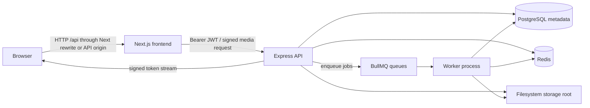
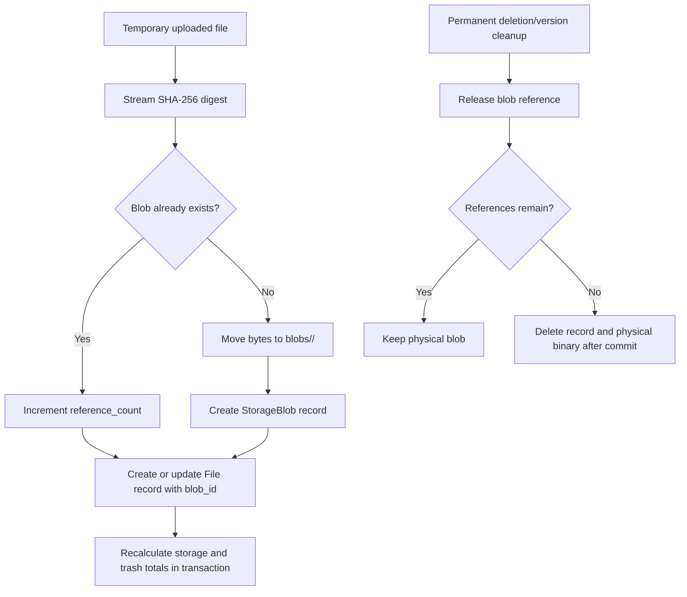

# NewCloud

<div align="center">
  <h3>Your private cloud, running like an OS.</h3>
  <p>
    A self-hosted file platform with cinematic UX, content-addressed storage,
    resumable uploads, signed media delivery, and integrity-first background maintenance.
  </p>
  <p>
    <a href="#quick-start"><strong>Get Started</strong></a> |
    <a href="./ARCHITECTURE.md">Architecture</a> |
    <a href="./API.md">API Reference</a> |
    <a href="./CONTRIBUTING.md">Contributing</a>
  </p>
  <p>
    
    
    
    
    
    
  </p>
</div>

---

NewCloud is a LAN-friendly, self-hosted cloud storage application designed for people who
want the convenience of a polished cloud drive while keeping the binary data on hardware
they control. A Next.js interface speaks to an Express API; PostgreSQL owns metadata,
Redis and BullMQ operate asynchronous maintenance, and the filesystem stores immutable
SHA-256 addressed blobs.

The current platform is built around one principle: file operations must preserve storage
integrity. Uploads become reference-counted blobs, trash and restore operations recalculate
accounting transactionally, media is delivered through short-lived signed URLs, and
scheduled workers reconcile drift and clean stale state.

## Overview

NewCloud sits between a personal NAS and a modern hosted drive:

| Principle                  | What it means in NewCloud                                                                                                   |
| -------------------------- | --------------------------------------------------------------------------------------------------------------------------- |
| Self-hosted by default     | PostgreSQL, Redis, the API, workers, and the UI run in your Compose deployment.                                             |
| Filesystem-first storage   | Original binary content lives under `STORAGE_ROOT`, with metadata in PostgreSQL.                                            |
| LAN-first access           | The API exposes network status and mDNS publishes local service discovery names.                                            |
| Integrity before expansion | Blob references, storage totals, stale chunks, and metadata are actively verified.                                          |
| One polished web surface   | A glass-panel file manager, previews, upload queue, sharing, settings, and landing experience ship in the Next.js frontend. |

## Features

| Area                      | Implementation                                                                                                                                                          |
| ------------------------- | ----------------------------------------------------------------------------------------------------------------------------------------------------------------------- |
| Content-addressed storage | Binary content is stored once per SHA-256 digest in `StorageBlob`; files and versions point to blobs.                                                                   |
| Deduplication             | Identical uploads increment a blob reference count instead of reusing another file's stored filename or copying bytes.                                                  |
| Direct uploads            | Multipart uploads stream to a temporary file on disk through Multer rather than accumulating the entire payload in memory.                                              |
| Chunked uploads           | Files larger than 10 MiB in the frontend are divided into server-sized chunks, hashed, retried, merged in a BullMQ worker, and finalized into blob storage.             |
| Upload validation         | Known binary signatures are checked for formats such as PNG, JPEG, GIF, WebP, PDF, ZIP-family documents, and MP4-family media. Dangerous file blocking is configurable. |
| Signed media access       | Authenticated clients request five-minute media URLs for preview, thumbnail, and download flows without placing access JWTs in media element URLs.                      |
| File management           | Nested logical folders, breadcrumb navigation, rename, move, copy, favorites, trash, permanent removal, bulk actions, and versions.                                     |
| Sharing                   | Public share tokens support optional password protection and expiration.                                                                                                |
| Previews                  | Images, video, audio, PDF, and selected text/code content render in the browser; thumbnail generation uses Sharp, FFmpeg, and Poppler.                                  |
| Integrity maintenance     | Workers repair storage totals, reference counts, blob metadata, legacy attachment state, old chunks, trash retention, and unreferenced blobs.                           |
| Deployment                | Docker Compose provisions PostgreSQL 16, Redis 7, the Express API, the Next.js UI, and a dedicated worker process.                                                      |
| Visual system             | Dark cinematic surfaces, glass treatments, cyan/violet accent lighting, Framer Motion landing transitions, and dense file-manager controls.                             |

## Screenshots

### Landing Atmosphere

The landing hero uses the committed cinematic poster as its loading and reduced-motion
fallback, with the accompanying background video rendered by the web application.

<p align="center">
  
</p>

### Product Surfaces

The application contains these screenshot-ready product views. UI captures are intentionally
not committed to the repository at this time, so documentation does not ship stale images.

| Surface                    | What to inspect                                                                                       |
| -------------------------- | ----------------------------------------------------------------------------------------------------- |
| Dashboard and file manager | Category shortcuts, grid/list modes, navigation history, sidebar storage meter, and preview workflow. |
| Upload UI                  | Drag-and-drop dialog plus the persistent upload queue with per-file chunk progress and merge state.   |
| Settings                   | Profile, filesystem storage metrics, LAN access URLs, and QR access helper.                           |
| Sharing                    | Public file landing page with protected-share prompt and inline preview for supported content.        |

## Architecture Overview



### Runtime Responsibilities

| Layer                   | Responsibilities                                                                                                                                     |
| ----------------------- | ---------------------------------------------------------------------------------------------------------------------------------------------------- |
| `frontend/`             | Next.js App Router UI, Axios API client, Zustand state, cinematic landing page, file explorer, upload queue, previews, settings, and public shares.  |
| `backend/src/server.ts` | HTTP entrypoint, CORS and security middleware, API mounting, Bull Board, storage initialization, mDNS publication, and WebSocket server startup.     |
| `backend/src/services/` | Domain logic for files, folders, blobs, accounting, uploads, media tokens, authentication, sharing, versions, storage paths, and thumbnails.         |
| `backend/src/workers/`  | Chunk finalization, thumbnails, retention cleanup, storage/reference verification, metadata repair, and migration of legacy files into blob storage. |
| PostgreSQL              | Metadata and transactional relationships: users, files, folders, blobs, versions, sessions, shares, activity, and notifications.                     |
| Redis                   | BullMQ transport, selected caching support, and the WebSocket/event infrastructure transport.                                                        |
| Filesystem              | Immutable content blobs, temporary upload material, chunk staging, and generated thumbnails.                                                         |

For internals, invariants, and data flows, see [ARCHITECTURE.md](./ARCHITECTURE.md).

## Tech Stack

| Concern                   | Technology                                                  |
| ------------------------- | ----------------------------------------------------------- |
| UI framework              | Next.js 15, React 18, TypeScript                            |
| Styling and motion        | Tailwind CSS, Radix primitives, Lucide icons, Framer Motion |
| Client state and requests | Zustand, Axios                                              |
| API                       | Express, Zod, JWT, Multer, Helmet, CORS                     |
| Database                  | PostgreSQL 16, Prisma ORM                                   |
| Jobs and caching          | Redis 7, BullMQ, Bull Board                                 |
| Media processing          | Sharp, FFmpeg, Poppler                                      |
| Network discovery         | `bonjour-service` mDNS publication                          |
| Testing and quality       | Vitest, ESLint, Prettier, strict TypeScript                 |
| Containers                | Docker Compose, Node.js 20 Alpine images                    |

## Quick Start

### Prerequisites

- Docker Desktop with Compose support
- Git
- Optional for manual development: Node.js 20+ and a local PostgreSQL/Redis pair

### Docker Compose

1. Clone and enter the repository.

   ```bash
   git clone https://github.com/ShadowSafin/NewCloud.git
   cd NewCloud
   ```

2. Create configuration from the template.

   ```bash
   cp .env.example .env
   ```

   On PowerShell:

   ```powershell
   Copy-Item .env.example .env
   ```

3. Replace every secret placeholder in `.env` with independent random values of at
   least 32 characters. Production startup rejects weak values.

   ```powershell
   $bytes = New-Object byte[] 32
   [Security.Cryptography.RandomNumberGenerator]::Fill($bytes)
   [Convert]::ToHexString($bytes)
   ```

   Required secrets:

   ```dotenv
   JWT_SECRET=<strong-random-secret>
   JWT_REFRESH_SECRET=<different-strong-random-secret>
   MEDIA_TOKEN_SECRET=<different-strong-random-secret>
   BULL_BOARD_PASSWORD=<different-strong-random-password>
   ```

4. Start the stack.

   ```bash
   docker compose up -d --build
   ```

5. Open the interface and health endpoint.

   | Service         | URL                                                                      |
   | --------------- | ------------------------------------------------------------------------ |
   | Web application | [http://localhost:3000](http://localhost:3000)                           |
   | API health      | [http://localhost:4000/health](http://localhost:4000/health)             |
   | Queue dashboard | [http://localhost:4000/admin/queues](http://localhost:4000/admin/queues) |

The backend container executes `prisma migrate deploy` before starting. It does not use
destructive schema synchronization.

### Useful Compose Commands

```bash
docker compose ps
docker compose logs -f backend worker
docker compose restart backend worker
docker compose down
```

Persistent data remains in the PostgreSQL and Redis named volumes and in the bind-mounted
`./data` directory unless explicitly removed.

### Manual Development

Start PostgreSQL and Redis first, then configure a backend environment with a valid
`DATABASE_URL`, `REDIS_URL`, storage path, and strong secrets.

```bash
cd backend
npm install
npx prisma generate
npx prisma migrate dev
npm run dev
```

In another terminal:

```bash
cd backend
npm run worker
```

In another terminal:

```bash
cd frontend
npm install
echo "NEXT_PUBLIC_API_URL=http://localhost:4000" > .env.local
npm run dev
```

On PowerShell, create the frontend environment with:

```powershell
Set-Content .env.local "NEXT_PUBLIC_API_URL=http://localhost:4000"
```

## Configuration

| Variable                        | Purpose                                                              | Default or example                       |
| ------------------------------- | -------------------------------------------------------------------- | ---------------------------------------- |
| `DATABASE_URL`                  | PostgreSQL connection for the API and worker                         | Required in production                   |
| `REDIS_URL`                     | BullMQ and Redis connection                                          | `redis://localhost:6379` in local config |
| `BACKEND_PORT` / `PORT`         | Published API port / process port                                    | `4000`                                   |
| `NEXT_PUBLIC_API_URL`           | Browser-visible API origin; blank in Compose to use Next.js rewrites | `http://localhost:4000` for manual dev   |
| `INTERNAL_API_URL`              | Next.js rewrite destination inside Compose                           | `http://cloud-backend:4000`              |
| `FRONTEND_URL`                  | Allowed frontend origin seed for CORS                                | `http://localhost:3000`                  |
| `STORAGE_ROOT`                  | Root for blobs, uploads, and thumbnails                              | `/app/data/storage`                      |
| `MAX_FILE_SIZE`                 | Maximum accepted whole upload in bytes                               | `1099511627776` (1 TiB)                  |
| `UPLOAD_CHUNK_SIZE`             | Chunk size returned when a session is initiated                      | `16777216` (16 MiB)                      |
| `MAX_UPLOAD_CHUNK_SIZE`         | Multer ceiling for an individual chunk                               | `268435456` (256 MiB)                    |
| `BLOCK_DANGEROUS_UPLOADS`       | Reject executable/dangerous extensions and MIME types                | `false`                                  |
| `TRASH_RETENTION_DAYS`          | Scheduled trash removal age                                          | `30`                                     |
| `MAX_VERSIONS_PER_FILE`         | Version retention target per file                                    | `10`                                     |
| `JWT_SECRET`                    | Access-token signing secret                                          | Required; strong in production           |
| `JWT_REFRESH_SECRET`            | Refresh-token signing secret                                         | Required; strong in production           |
| `MEDIA_TOKEN_SECRET`            | Short-lived media URL signing secret                                 | Required; strong in production           |
| `BULL_BOARD_USERNAME`           | Queue dashboard username                                             | `admin`                                  |
| `BULL_BOARD_PASSWORD`           | Queue dashboard password                                             | Required; strong in production           |
| `HOST_LAN_IP` / `HOST_HOSTNAME` | Values reported by LAN status discovery                              | Set by `start.ps1` or manually           |

## Local Network Access

NewCloud listens on all interfaces in the backend container and the settings screen exposes
available LAN URLs. The PowerShell helper detects a local address and hostname, writes
`HOST_LAN_IP` and `HOST_HOSTNAME` into `.env`, then builds and starts Compose:

```powershell
.\start.ps1
```

After startup, browser clients on the same local network can normally use:

```text
http://<host-lan-ip>:3000
http://<hostname>.local:3000
```

The API publishes both the web service and API service over mDNS. Private IPv4 origins and
local hostnames are accepted by the API CORS policy. For any network beyond a trusted LAN,
place NewCloud behind HTTPS and a reverse proxy.

## Storage Engine

### Physical Layout

```text
STORAGE_ROOT/
|-- blobs/
|   `-- <first-two-sha256-characters>/
|       `-- <full-sha256-digest>
|-- tmp/
`-- <user-id>/
    |-- files/
    |-- thumbnails/
    |-- uploads/
    |   |-- incoming/
    |   `-- chunks/<session-id>/
    `-- versions/
```

Folders are metadata relationships, not nested physical directories. This permits move and
copy operations without moving binary data on disk.

### Blob Lifecycle



`storageUsed` represents active file metadata bytes and `trashSize` represents trashed file
metadata bytes. Copying content can therefore increase logical user usage while preserving
one physical blob.

### Resumable Chunk Uploads

The browser sends files larger than 10 MiB through the chunk pipeline:

1. `POST /api/uploads/initiate` creates an upload session and expected chunk records.
2. Chunks are sent concurrently, up to three at a time in the current client, with
   optional SHA-256 verification for each part.
3. `POST /api/uploads/:sessionId/complete` queues a merge job.
4. The worker streams chunks into a temporary merged file while calculating the final hash.
5. Signature validation runs against the merged binary.
6. The merged file enters content-addressed storage and storage accounting is recalculated.
7. Chunk files are removed and preview generation can be queued.

## Security

| Control              | Current behavior                                                                                                          |
| -------------------- | ------------------------------------------------------------------------------------------------------------------------- |
| Authentication       | Access JWTs and persisted rotating refresh tokens; protected REST requests use `Authorization: Bearer <token>`.           |
| Media access         | Preview and download elements use expiring signed media URLs issued by authenticated API requests.                        |
| Upload memory safety | Direct and chunk uploads are staged to disk by Multer with configurable size ceilings.                                    |
| Signature validation | Common media/document container signatures are checked against uploaded bytes.                                            |
| Dangerous content    | Executable and risky extensions/MIME types can be blocked with `BLOCK_DANGEROUS_UPLOADS=true`; it is disabled by default. |
| Filesystem safety    | Blob and user storage paths are resolved beneath the configured storage root before destructive work.                     |
| Deployment secrets   | Production startup rejects missing, weak, or placeholder signing and queue-dashboard secrets.                             |
| Database rollout     | Compose uses Prisma migrations with `prisma migrate deploy`.                                                              |

Important deployment guidance:

- Set `BLOCK_DANGEROUS_UPLOADS=true` on installations intended to accept content from
  untrusted users.
- Terminate HTTPS before exposing NewCloud beyond a trusted local network.
- Protect `/admin/queues` with a strong unique password and restrict it at the proxy when possible.
- Back up PostgreSQL metadata and the entire `data/storage` tree together.

## Background Integrity Workers

| Queue                    | Responsibility                                                                    | Schedule or trigger               |
| ------------------------ | --------------------------------------------------------------------------------- | --------------------------------- |
| `chunk-merge`            | Merge completed chunk sessions, validate content, create/update blob-backed files | On upload completion              |
| `thumbnail-generation`   | Build image/video/PDF previews                                                    | After eligible chunk finalization |
| `trash-cleanup`          | Permanently remove expired trashed files and folders                              | Daily at 02:00                    |
| `storage-integrity`      | Compare and repair `storageUsed` and `trashSize`                                  | Startup and daily at 02:15        |
| `reference-verification` | Recount file/version references for every blob                                    | Startup and daily at 02:30        |
| `metadata-repair`        | Align file path/hash/size with blob metadata and enqueue legacy migration         | Startup and daily at 02:45        |
| `orphan-blob-cleanup`    | Delete zero-reference blob rows and physical bytes                                | Daily at 03:00                    |
| `chunk-cleanup`          | Cancel stale sessions and remove old staged chunks                                | Every 30 minutes                  |
| `version-cleanup`        | Limit retained file versions                                                      | Triggered by version creation     |

## API and Realtime

The REST surface covers authentication, files, folders, uploads, versions, sharing,
signed media, and LAN status. See [API.md](./API.md) for endpoints and request examples.

A WebSocket server and Redis-backed event transport are included at `/ws`. At present,
the file and folder mutation services do not emit through that event layer, so consumers
should treat live mutation synchronization as integration work still to be completed.

## Testing and Quality

```bash
cd backend
npm run test
npm run lint
npm run typecheck
npm run build

cd ../frontend
npm run lint
npm run typecheck
npm run build
```

The current Vitest suite covers binary signature validation and dangerous-type detection.
Storage, blob-reference, chunk-session, and HTTP integration suites are high-priority
additions for contributors.

## Roadmap

| Status                 | Workstream                                                                                                                                                                  |
| ---------------------- | --------------------------------------------------------------------------------------------------------------------------------------------------------------------------- |
| Implemented foundation | Content-addressed storage, reference counting, signed media, chunk merging, integrity workers, Compose migration startup.                                                   |
| Harden next            | Full API/storage integration test coverage, strict upload policy profiles, event emission wiring, hardened WebSocket authentication, share-password transport improvements. |
| Evolve later           | Collaboration primitives, index/search exposure, richer activity views, and operational metrics.                                                                            |

## Contributing

Start with [CONTRIBUTING.md](./CONTRIBUTING.md), then use
[ARCHITECTURE.md](./ARCHITECTURE.md) to understand invariants before changing storage or
upload behavior. Any change involving blob references, trash state, chunk sessions, or
media authorization should arrive with tests that exercise failure and cleanup paths.

## License

No license file is currently committed in this repository. Add an explicit license before
publishing or redistributing NewCloud as an open-source project.
