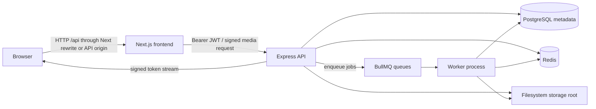
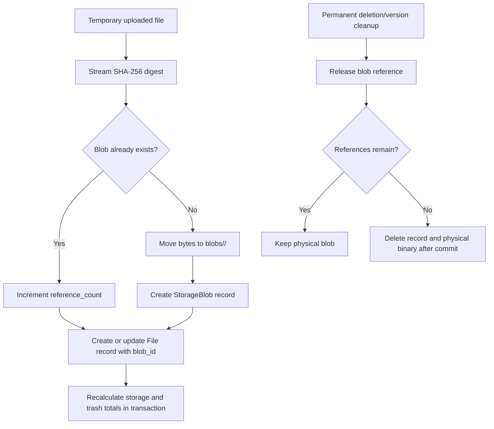

<div align="center">
  
  <br>
  <h1>NexxCloud</h1>
  <h3>Your private cloud, running like an OS.</h3>
  <p>
    A self-hosted file platform with cinematic UX, content-addressed storage,
    resumable uploads, signed media delivery, and integrity-first background maintenance.
  </p>
  <p>
    <a href="#deploy-nexxcloud-in-one-command"><strong>Deploy NexxCloud</strong></a> |
    <a href="./ARCHITECTURE.md">Architecture</a> |
    <a href="./API.md">API Reference</a> |
    <a href="./CONTRIBUTING.md">Contributing</a>
  </p>
  <p>
    
    
    
    
    
    
    
    
    
  </p>
</div>

---

## Deploy NexxCloud in One Command

> Requires Docker Engine or Docker Desktop with Docker Compose v2, plus Git.

| Linux / macOS / NAS / VPS | Windows PowerShell |
| ------------------------- | ------------------ |
| `curl -fsSL https://raw.githubusercontent.com/ShadowSafin/NexxCloud/main/install.sh \| sh` | `irm https://raw.githubusercontent.com/ShadowSafin/NexxCloud/main/install.ps1 \| iex` |

```bash
curl -fsSL https://raw.githubusercontent.com/ShadowSafin/NexxCloud/main/install.sh | sh
```

```powershell
irm https://raw.githubusercontent.com/ShadowSafin/NexxCloud/main/install.ps1 | iex
```

<div align="center">

`Clone repository` &nbsp; -> &nbsp; `Generate secure secrets` &nbsp; -> &nbsp; `Build 5 services` &nbsp; -> &nbsp; `Run safe migrations` &nbsp; -> &nbsp; `Ready on :3000`

</div>

| Open after deployment | Address |
| --------------------- | ------- |
| NexxCloud              | [http://localhost:3000](http://localhost:3000) |
| API readiness         | [http://localhost:4000/health/ready](http://localhost:4000/health/ready) |
| Queue operations      | [http://localhost:4000/admin/queues](http://localhost:4000/admin/queues) |

The installer clones into `$HOME/NexxCloud` on Unix systems or
`%USERPROFILE%\NexxCloud` on Windows, creates production secrets, persistent data paths,
health-checked containers, and committed migration state. It waits for the API,
frontend, and background worker before announcing readiness, and never runs destructive
schema synchronization.

---

## Native Server Installers (No Docker)

NexxCloud also ships as a lightweight native server host alongside Docker. The native
installer runs the existing web interface and API locally, adds a system tray control
panel, and removes the requirement to install PostgreSQL or Redis.

| Deployment choice | Data and processing | Best for |
| ----------------- | ------------------- | -------- |
| Docker Compose | PostgreSQL, Redis/BullMQ, five isolated services | NAS, VPS, container hosts, multi-service operations |
| Native Server | Embedded SQLite, in-process workers/cache, bundled frontend/API | Windows or Linux home servers and beginner installs |

### Installer Experience

1. Install **NexxCloud Server** from a generated Windows `.exe`, Linux `.AppImage`,
   `.deb`, or `.rpm` release artifact.
2. Choose the data directory, such as `D:\NexxCloudData` or
   `/mnt/storage/NexxCloudData`.
3. Choose the browser port and leave **Start on login** enabled.
4. The tray host initializes its local database, starts the API/workers/UI, and opens
   the dashboard on `http://localhost:3000`.

The native data directory is intentionally portable and backup-friendly:

```text
NexxCloudData/
|-- uploads/        # incoming/user staging paths
|-- blobs/          # content-addressed physical files
|-- previews/       # derived previews
|-- thumbnails/     # derived thumbnails
|-- temp/           # reserved temporary work location
|-- tmp/            # current backend scratch work
|-- logs/           # backend/frontend/migration logs
|-- database/       # SQLite database and applied migration ledger
`-- backups/        # tray-created database/config snapshots
```

### Build Native Installers

```powershell
cd native
npm install
npm run dist:windows
```

```bash
cd native
npm install
npm run dist:linux
```

Installer output is written to `native/release/`. Tagged GitHub builds use
[`.github/workflows/native-release.yml`](./.github/workflows/native-release.yml) to
publish Windows and Linux artifacts. Native storage uses the same blob and integrity
logic as Docker; the runtime substitution is SQLite plus local workers rather than
PostgreSQL plus Redis.

The control window runs with Electron renderer isolation and navigation blocked outside
its local setup UI. Dashboard navigation is opened through explicit tray commands in the
system browser, while local secrets remain in the per-user native configuration file and
its user-created backups.

For signed Windows releases, configure the repository secrets `WINDOWS_CSC_LINK` and
`WINDOWS_CSC_KEY_PASSWORD` with the code-signing certificate used by Electron Builder.
Locally generated `.exe` installers are unsigned unless that certificate is supplied.

---

## Windows Desktop Client

`desktop/` is a lightweight Electron client for people who already have NexxCloud
running through Docker, a native server install, or another machine on their LAN. It
does not host services, embed database files, or copy the Next.js application; once
connected, its window loads the existing web interface directly from the chosen server.

| Desktop capability | Behavior |
| ------------------ | -------- |
| Server connection | Detects `http://localhost:3000`, accepts LAN or HTTPS URLs, saves recent servers, and reconnects after interruptions. |
| Native window | Keeps persistent login sessions, restores bounds, supports fullscreen/maximize, and minimizes to a Windows tray icon. |
| Safety boundary | Uses `contextIsolation`, sandboxed rendering, no Node.js in the web page, restricted origins, and local-only settings IPC. |
| Windows install | NSIS installer offers desktop/start menu shortcuts, startup launch, launch-after-install, uninstall cleanup, and signing preparation. |

### Build the Desktop Installer

```powershell
cd desktop
npm install
npm run dist:windows
```

The generated installer is written to `desktop/release/` and intentionally ignored by
Git. Publish it as a GitHub Release artifact rather than committing executable binaries.
The desktop window connects to an existing deployment at an address such as
`http://localhost:3000`, `http://192.168.1.20:3000`, or an HTTPS reverse-proxy URL.

---

## Overview

NexxCloud is a LAN-friendly, self-hosted cloud storage application designed for people who
want the convenience of a polished cloud drive while keeping the binary data on hardware
they control. A Next.js interface speaks to an Express API; PostgreSQL owns metadata,
Redis and BullMQ operate asynchronous maintenance, and the filesystem stores immutable
SHA-256 addressed blobs.

The platform is built around one principle: file operations must preserve storage
integrity. Uploads become reference-counted blobs, trash and restore operations recalculate
accounting transactionally, media is delivered through short-lived signed URLs, and
scheduled workers reconcile drift and clean stale state.

NexxCloud sits between a personal NAS and a modern hosted drive:

| Principle                  | What it means in NexxCloud                                                                                                   |
| -------------------------- | --------------------------------------------------------------------------------------------------------------------------- |
| Self-hosted by default     | Choose a five-service Compose deployment or a native local server installer without surrendering file ownership.           |
| Filesystem-first storage   | Original binary content lives under `STORAGE_ROOT`; metadata uses PostgreSQL in Docker or SQLite in native installs.       |
| LAN-first access           | The API exposes network status and mDNS publishes local service discovery names.                                            |
| Integrity before expansion | Blob references, storage totals, stale chunks, and metadata are actively verified.                                          |
| One polished web surface   | A glass-panel file manager, previews, upload queue, sharing, settings, and landing experience ship in the Next.js frontend. |

## Features

| Area                      | Implementation                                                                                                                                                          |
| ------------------------- | ----------------------------------------------------------------------------------------------------------------------------------------------------------------------- |
| Content-addressed storage | Binary content is stored once per SHA-256 digest in `StorageBlob`; files and versions point to blobs.                                                                   |
| Deduplication             | Identical uploads increment a blob reference count instead of reusing another file's stored filename or copying bytes.                                                  |
| Direct uploads            | Multipart uploads stream to a temporary file on disk through Multer rather than accumulating the entire payload in memory.                                              |
| Chunked uploads           | Files larger than 10 MiB in the frontend are divided into server-sized chunks, hashed, retried, merged in a BullMQ worker, and finalized into blob storage.             |
| Upload validation         | Every extension, including custom and executable formats, is stored as opaque content; claimed preview formats still receive signature checks and active content is sandboxed on delivery. |
| Signed media access       | Authenticated clients request five-minute media URLs for preview, thumbnail, and download flows without placing access JWTs in media element URLs.                      |
| File management           | Nested logical folders, breadcrumb navigation, rename, move, copy, favorites, trash, permanent removal, bulk actions, and versions.                                     |
| Sharing                   | Public share tokens support optional password protection and expiration.                                                                                                |
| Previews                  | Images, video, audio, PDF, and selected text/code content render in the browser; thumbnail generation uses Sharp, FFmpeg, and Poppler.                                  |
| Integrity maintenance     | Workers repair storage totals, reference counts, blob metadata, legacy attachment state, old chunks, trash retention, and unreferenced blobs.                           |
| Deployment                | Docker Compose and native server packages host the platform; the Windows desktop client connects to either without duplicating the web interface.                                      |
| Visual system             | Dark cinematic surfaces, glass treatments, cyan/violet accent lighting, Framer Motion landing transitions, and dense file-manager controls.                             |

## Screenshots

### Landing Atmosphere

The landing hero uses the committed cinematic poster as its loading and reduced-motion
fallback, with the accompanying background video rendered by the web application.

<p align="center">
  
</p>

### Product Surfaces

The application contains these screenshot-ready product views. UI captures are intentionally
not committed to the repository at this time, so documentation does not ship stale images.

| Surface                    | What to inspect                                                                                       |
| -------------------------- | ----------------------------------------------------------------------------------------------------- |
| Dashboard and file manager | Category shortcuts, grid/list modes, navigation history, sidebar storage meter, and preview workflow. |
| Upload UI                  | Drag-and-drop dialog plus the persistent upload queue with per-file chunk progress and merge state.   |
| Settings                   | Profile, filesystem storage metrics, LAN access URLs, and QR access helper.                           |
| Sharing                    | Public file landing page with protected-share prompt and inline preview for supported content.        |

## Architecture Overview



### Runtime Responsibilities

| Layer                   | Responsibilities                                                                                                                                     |
| ----------------------- | ---------------------------------------------------------------------------------------------------------------------------------------------------- |
| `frontend/`             | Next.js App Router UI, Axios API client, Zustand state, cinematic landing page, file explorer, upload queue, previews, settings, and public shares.  |
| `backend/src/server.ts` | HTTP entrypoint, CORS and security middleware, API mounting, Bull Board, storage initialization, mDNS publication, and WebSocket server startup.     |
| `backend/src/services/` | Domain logic for files, folders, blobs, accounting, uploads, media tokens, authentication, sharing, versions, storage paths, and thumbnails.         |
| `backend/src/workers/`  | Chunk finalization, thumbnails, retention cleanup, storage/reference verification, metadata repair, and migration of legacy files into blob storage. |
| PostgreSQL              | Metadata and transactional relationships: users, files, folders, blobs, versions, sessions, shares, activity, and notifications.                     |
| Redis                   | BullMQ transport, selected caching support, and the WebSocket/event infrastructure transport.                                                        |
| Filesystem              | Immutable content blobs, temporary upload material, chunk staging, and generated thumbnails.                                                         |

For internals, invariants, and data flows, see [ARCHITECTURE.md](./ARCHITECTURE.md).

## Tech Stack

| Concern                   | Technology                                                  |
| ------------------------- | ----------------------------------------------------------- |
| UI framework              | Next.js 15, React 18, TypeScript                            |
| Styling and motion        | Tailwind CSS, Radix primitives, Lucide icons, Framer Motion |
| Client state and requests | Zustand, Axios                                              |
| API                       | Express, Zod, JWT, Multer, Helmet, CORS                     |
| Database                  | PostgreSQL 16, Prisma ORM                                   |
| Jobs and caching          | Redis 7, BullMQ, Bull Board                                 |
| Media processing          | Sharp, FFmpeg, Poppler                                      |
| Network discovery         | `bonjour-service` mDNS publication                          |
| Testing and quality       | Vitest, ESLint, Prettier, strict TypeScript                 |
| Containers                | Docker Compose, Node.js Alpine runtime images               |
| Native distribution       | Electron host, SQLite, NSIS, AppImage, DEB, RPM            |

## Deployment Reference

### Customized Bootstrap

To deploy a selected branch or destination directory from the GitHub bootstrap:

```bash
curl -fsSL https://raw.githubusercontent.com/ShadowSafin/NexxCloud/main/install.sh |
  NEXXCLOUD_REPOSITORY_REF=my-branch NEXXCLOUD_INSTALL_DIR=/srv/nexxcloud sh
```

To test a second Windows installation beside a running NexxCloud instance:

```powershell
$env:NEXXCLOUD_INSTALL_DIR = "$HOME\NexxCloud-Test"
$env:NEXXCLOUD_PROJECT_NAME = "nexxcloud_test"
$env:NEXXCLOUD_FRONTEND_PORT = "3300"
$env:NEXXCLOUD_BACKEND_PORT = "4400"
irm https://raw.githubusercontent.com/ShadowSafin/NexxCloud/main/install.ps1 | iex
```

If the repository is already cloned, start it locally with `bash setup.sh` on Unix
systems or `setup.bat` on Windows.

### Startup Guarantees

Review scripts before piping remote code on sensitive servers. The standard deployment
path never uses destructive schema synchronization. Fresh databases run
`prisma migrate deploy`; databases created by the earlier schema-push startup are
detected on Prisma `P3005`, upgraded with committed additive baseline SQL, recorded in
migration history, and returned to normal migration deployment only after identifying
the expected legacy NexxCloud tables. The API becomes healthy
only after PostgreSQL, Redis, and writable storage pass readiness checks.

### Deployment Scripts

| Script        | Platform       | Purpose                                                                 |
| ------------- | -------------- | ----------------------------------------------------------------------- |
| `install.sh`  | Linux/NAS/macOS | Remote GitHub bootstrap: clone or launch, then run secure setup.        |
| `install.ps1` | Windows        | Remote GitHub bootstrap from PowerShell.                               |
| `setup.sh`    | Linux/NAS/macOS | First boot: secure `.env`, storage directory, port check, build/start.  |
| `setup.bat`   | Windows        | First boot through PowerShell with cryptographic secret generation.     |
| `start.sh`    | Linux/NAS/macOS | Validate existing configuration and start/rebuild healthy services.     |
| `start.bat`   | Windows        | Validate and launch an existing Windows installation.                   |
| `update.sh`   | Linux/NAS/macOS | Dump PostgreSQL, fast-forward source, migrate safely, restart services. |

### Useful Commands

```bash
docker compose ps
docker compose logs -f backend worker
sh start.sh
sh update.sh
docker compose down
```

Persistent data remains in the PostgreSQL and Redis named volumes and in the bind-mounted
`./data` directory unless explicitly removed.

When upgrading an existing development installation, `setup.sh` and `setup.bat` preserve
explicit values already present in `.env`. Before exposing that installation outside a
trusted LAN, set `NODE_ENV=production`, replace any weak secrets, and configure HTTPS
proxy origins.

## Deployment Targets

The root [`docker-compose.yml`](./docker-compose.yml) is the deployment contract. It
builds `frontend`, `backend`, and `worker` from the repository and provisions internal
PostgreSQL and Redis services with health checks and persistent storage.

| Target                 | Deployment route                                                                                                               | Status                         |
| ---------------------- | ------------------------------------------------------------------------------------------------------------------------------ | ------------------------------ |
| Docker Compose         | Run the GitHub one-liner above, or run `bash setup.sh` / `setup.bat` from an existing checkout.                                | First-class                    |
| Windows Native Server  | Build or download the NSIS `.exe`; select a storage directory and run from the tray without Docker.                            | First-class native path        |
| Linux Native Server    | Build or download `.AppImage`, `.deb`, or `.rpm`; enable login startup from the tray host.                                     | First-class native path        |
| Windows Desktop Client | Install the WebView launcher and connect it to a running local, LAN, native, or Docker-hosted server.                           | First-class connected client   |
| Portainer              | Create a Git Repository stack targeting `docker-compose.yml`; paste production variables generated from `.env.example`.       | Compose-compatible             |
| Coolify                | Add a Docker Compose resource from GitHub, set required variables, and publish only the `frontend` service on port `3000`.     | Compose-compatible             |
| Dockge                 | Clone locally, run setup once for `.env`, then manage the root Compose stack in Dockge.                                        | Compose-compatible             |
| Cosmos Cloud           | Run NexxCloud with Docker Compose on the managed host; a native Cosmos-Compose marketplace descriptor is not yet distributed.  | Host Compose path              |
| CasaOS / Umbrel        | Use the host terminal deployment command; branded marketplace packaging is intentionally separate from the production stack. | Host Compose path              |
| Railway / Render       | Service-by-service Docker deployment can be prepared from these Dockerfiles; persistent volume and managed DB wiring needed.  | Future hosted-platform target  |

For panel deployments, do not commit `.env`. Generate five distinct 64-character hex
secrets locally and enter them as stack environment variables:

```bash
openssl rand -hex 32
```

Required variables are `DB_PASSWORD`, `JWT_SECRET`, `JWT_REFRESH_SECRET`,
`MEDIA_TOKEN_SECRET`, and `BULL_BOARD_PASSWORD`. Keep `NODE_ENV=production`.
Missing or weak values cause application startup to fail.

<details>
<summary><strong>Portainer Git stack</strong></summary>

1. In **Stacks**, choose **Add stack** and the Git repository option.
2. Enter this repository URL and `docker-compose.yml` as the Compose path.
3. Define the five required secrets above plus `FRONTEND_URL` for the address users open.
4. For durable file bytes across Git redeployments, set `NEXXCLOUD_DATA_DIR` to an
   absolute persistent host path, such as `/srv/nexxcloud/data`.
5. Deploy the stack and wait for `frontend` and `backend` health checks to become healthy.

Reference: [Portainer - add a stack from Git](https://docs.portainer.io/2.33-lts/user/docker/stacks/add)

</details>

<details>
<summary><strong>Coolify Compose resource</strong></summary>

1. Create a new resource from the public Git repository using the Docker Compose build pack.
2. Supply the required production variables before the initial deployment.
3. Map a domain to the `frontend` service on container port `3000`.
4. Keep `postgres` and `redis` private; do not publish them as domains or host ports.
5. Persist `/app/data` for `backend` and `worker` through the same host-backed path.

Reference: [Coolify - Docker Compose deployments](https://coolify.io/docs/knowledge-base/docker/compose)

</details>

<details>
<summary><strong>Control panels and future hosted platforms</strong></summary>

Dockge can operate the standard Compose project after `setup.sh` has securely created its
configuration. Cosmos Cloud uses a related Cosmos-Compose format with proxy-specific
extensions, so the standard host Compose path is supported while a marketplace manifest
is prepared separately. Railway does not execute `docker-compose.yml` directly; its
deployment path maps each Dockerfile/database/volume to separate services. Render similarly
uses individual Docker services rather than this five-service Compose stack.

References:
[Cosmos-Compose](https://docs.cosmos-cloud.io/guides/cosmos-compose/),
[Railway Compose translation](https://docs.railway.com/guides/docker-compose),
[Render Docker services](https://render.com/docs/docker)

</details>

### Manual Development

Start PostgreSQL and Redis first, then configure a backend environment with a valid
`DATABASE_URL`, `REDIS_URL`, storage path, and strong secrets.

```bash
cd backend
npm install
npx prisma generate
npx prisma migrate dev
npm run dev
```

In another terminal:

```bash
cd backend
npm run worker
```

In another terminal:

```bash
cd frontend
npm install
echo "NEXT_PUBLIC_API_URL=http://localhost:4000" > .env.local
npm run dev
```

On PowerShell, create the frontend environment with:

```powershell
Set-Content .env.local "NEXT_PUBLIC_API_URL=http://localhost:4000"
```

## Configuration

| Variable                        | Purpose                                                              | Default or example                       |
| ------------------------------- | -------------------------------------------------------------------- | ---------------------------------------- |
| `NODE_ENV`                      | Enables production secret and startup safety checks                  | `production` in deployments              |
| `COMPOSE_PROJECT_NAME`          | Isolates services, volumes, and networks per deployment              | `nexxcloud`                               |
| `DB_PASSWORD`                   | PostgreSQL password; also validated before production API startup    | Generated by setup                       |
| `DATABASE_URL`                  | PostgreSQL connection for the API and worker                         | Required in production                   |
| `REDIS_URL`                     | BullMQ and Redis connection                                          | `redis://localhost:6379` in local config |
| `BACKEND_PORT` / `PORT`         | Published API port / process port                                    | `4000`                                   |
| `NEXT_PUBLIC_API_URL`           | Browser-visible API origin; blank in Compose to use Next.js rewrites | `http://localhost:4000` for manual dev   |
| `INTERNAL_API_URL`              | Next.js rewrite destination inside Compose                           | `http://backend:4000`                    |
| `FRONTEND_URL`                  | Allowed frontend origin seed for CORS                                | `http://localhost:3000`                  |
| `STORAGE_ROOT`                  | Root for blobs, uploads, and thumbnails                              | `/app/data/storage`                      |
| `MAX_FILE_SIZE`                 | Maximum accepted whole upload in bytes                               | `1099511627776` (1 TiB)                  |
| `UPLOAD_CHUNK_SIZE`             | Chunk size returned when a session is initiated                      | `8388608` (8 MiB; safe via UI proxy)     |
| `MAX_UPLOAD_CHUNK_SIZE`         | Multer ceiling for an individual chunk                               | `268435456` (256 MiB)                    |
| `TRASH_RETENTION_DAYS`          | Scheduled trash removal age                                          | `30`                                     |
| `MAX_VERSIONS_PER_FILE`         | Version retention target per file                                    | `10`                                     |
| `JWT_SECRET`                    | Access-token signing secret                                          | Required; strong in production           |
| `JWT_REFRESH_SECRET`            | Refresh-token signing secret                                         | Required; strong in production           |
| `MEDIA_TOKEN_SECRET`            | Short-lived media URL signing secret                                 | Required; strong in production           |
| `BULL_BOARD_USERNAME`           | Queue dashboard username                                             | `admin`                                  |
| `BULL_BOARD_PASSWORD`           | Queue dashboard password                                             | Required; strong in production           |
| `TRUST_PROXY`                   | Trusted proxy hops for secure forwarding behavior                    | Private/local proxy ranges               |
| `CORS_ORIGINS`                  | Comma-separated additional HTTPS frontend origins                    | Blank                                    |
| `HOST_LAN_IP` / `HOST_HOSTNAME` | Values reported by LAN status discovery                              | Set by launch scripts or manually        |

## Local Network Access

NexxCloud binds the UI and API to all host interfaces by default for trusted home-network
installations. The launchers write detected network information into `.env`; LAN-connected
browser clients can then open the same interface:

```text
http://<host-lan-ip>:3000
http://<hostname>.local:3000
```

The API publishes both the web service and API service over mDNS. Private IPv4 origins and
local hostnames are accepted by the API CORS policy. For any network beyond a trusted LAN,
place NexxCloud behind HTTPS and a reverse proxy.

## Reverse Proxy and HTTPS

The recommended public shape publishes the frontend and keeps browser API requests
same-origin through the Next.js `/api` rewrite. Route `/ws` directly to backend port
`4000` when enabling WebSocket clients.

| Proxy                        | Setup                                                                                 |
| ---------------------------- | ------------------------------------------------------------------------------------- |
| Caddy                        | Copy [`deploy/Caddyfile.example`](./deploy/Caddyfile.example) and set your hostname. |
| Traefik / Coolify            | Apply [`deploy/compose.traefik.yml`](./deploy/compose.traefik.yml) as an overlay.    |
| Nginx Proxy Manager          | Proxy the hostname to `frontend:3000`; add a `/ws` advanced location to `backend:4000` with WebSocket upgrade headers. |
| Cloudflare Tunnel            | Tunnel the HTTPS hostname to the frontend; separately preserve `/ws` upgrades if realtime transport is enabled. |

For a public proxy host, restrict direct host exposure:

```dotenv
FRONTEND_BIND_ADDRESS=127.0.0.1
BACKEND_BIND_ADDRESS=127.0.0.1
FRONTEND_URL=https://cloud.example.com
CORS_ORIGINS=https://cloud.example.com
```

The PostgreSQL and Redis services are never bound to host ports in the production Compose
file; they remain on an internal data network.

## Persistence, Backups, and Updates

| Data                       | Location                                                | Backup rule                                     |
| -------------------------- | ------------------------------------------------------- | ----------------------------------------------- |
| File blobs and thumbnails  | `${NEXXCLOUD_DATA_DIR:-./data}/storage` on the host      | Back up together with database metadata.        |
| PostgreSQL metadata        | Docker volume `${COMPOSE_PROJECT_NAME}_postgres_data`    | Use `pg_dump` before updates and on a schedule. |
| Redis queue persistence    | Docker volume `${COMPOSE_PROJECT_NAME}_redis_data`       | Useful for queued work; not file metadata.      |
| Temporary upload material  | Within the storage bind mount                           | May be cleaned after interrupted uploads.       |

On Linux-based hosts, `sh update.sh` creates a timestamped PostgreSQL dump under the
ignored `backups/` directory, pulls a fast-forward Git update, rebuilds, and allows only
committed migrations or the committed additive legacy baseline to run. The first upgrade
from an older schema-push installation is baselined automatically after that database
dump. Back up the storage tree separately before upgrades that affect binary handling.

To diagnose startup:

```bash
docker compose ps
docker compose logs --tail=150 backend worker frontend
curl -fsS http://localhost:4000/health/ready
curl -fsS http://localhost:3000/health
```

## Storage Engine

### Physical Layout

```text
STORAGE_ROOT/
|-- blobs/
|   `-- <first-two-sha256-characters>/
|       `-- <full-sha256-digest>
|-- tmp/
`-- <user-id>/
    |-- files/
    |-- thumbnails/
    |-- uploads/
    |   |-- incoming/
    |   `-- chunks/<session-id>/
    `-- versions/
```

Folders are metadata relationships, not nested physical directories. This permits move and
copy operations without moving binary data on disk.

### Blob Lifecycle



`storageUsed` represents active file metadata bytes and `trashSize` represents trashed file
metadata bytes. Copying content can therefore increase logical user usage while preserving
one physical blob.

### Resumable Chunk Uploads

The browser sends files larger than 10 MiB through the chunk pipeline:

1. `POST /api/uploads/initiate` creates an upload session and expected chunk records.
2. Chunks are sent concurrently, up to three at a time in the current client, with
   optional SHA-256 verification for each part.
3. `POST /api/uploads/:sessionId/complete` queues a merge job.
4. The worker streams chunks into a temporary merged file while calculating the final hash.
5. Signature validation runs against the merged binary.
6. The merged file enters content-addressed storage and storage accounting is recalculated.
7. Chunk files are removed and preview generation can be queued.

## Security

| Control              | Current behavior                                                                                                          |
| -------------------- | ------------------------------------------------------------------------------------------------------------------------- |
| Authentication       | Access JWTs and persisted rotating refresh tokens; protected REST requests use `Authorization: Bearer <token>`.           |
| Media access         | Preview and download elements use expiring signed media URLs issued by authenticated API requests.                        |
| Upload memory safety | Direct and chunk uploads are staged to disk by Multer with configurable size ceilings.                                    |
| Signature validation | Common media/document container signatures are checked against uploaded bytes.                                            |
| Dangerous content    | Executable and risky extensions/MIME types are blocked by default in the deployment configuration.                          |
| Filesystem safety    | Blob and user storage paths are resolved beneath the configured storage root before destructive work.                     |
| Deployment secrets   | Production startup rejects missing, weak, or placeholder signing and queue-dashboard secrets.                             |
| Database rollout     | Compose uses Prisma migrations; pre-migration installs receive a guarded additive baseline on Prisma `P3005`.           |

Important deployment guidance:

- NexxCloud accepts arbitrary file formats as stored content. Treat shared executable or
  active-document files with the same caution you would apply to downloaded attachments.
- Terminate HTTPS before exposing NexxCloud beyond a trusted local network.
- Protect `/admin/queues` with a strong unique password and restrict it at the proxy when possible.
- Back up PostgreSQL metadata and the entire `data/storage` tree together.

## Background Integrity Workers

| Queue                    | Responsibility                                                                    | Schedule or trigger               |
| ------------------------ | --------------------------------------------------------------------------------- | --------------------------------- |
| `chunk-merge`            | Merge completed chunk sessions, validate content, create/update blob-backed files | On upload completion              |
| `thumbnail-generation`   | Build image/video/PDF previews                                                    | After eligible chunk finalization |
| `trash-cleanup`          | Permanently remove expired trashed files and folders                              | Daily at 02:00                    |
| `storage-integrity`      | Compare and repair `storageUsed` and `trashSize`                                  | Startup and daily at 02:15        |
| `reference-verification` | Recount file/version references for every blob                                    | Startup and daily at 02:30        |
| `metadata-repair`        | Align file path/hash/size with blob metadata and enqueue legacy migration         | Startup and daily at 02:45        |
| `orphan-blob-cleanup`    | Delete zero-reference blob rows and physical bytes                                | Daily at 03:00                    |
| `chunk-cleanup`          | Cancel stale sessions and remove old staged chunks                                | Every 30 minutes                  |
| `version-cleanup`        | Limit retained file versions                                                      | Triggered by version creation     |

## API and Realtime

The REST surface covers authentication, files, folders, uploads, versions, sharing,
signed media, and LAN status. See [API.md](./API.md) for endpoints and request examples.

A WebSocket server and Redis-backed event transport are included at `/ws`. At present,
the file and folder mutation services do not emit through that event layer, so consumers
should treat live mutation synchronization as integration work still to be completed.

## Testing and Quality

```bash
cd backend
npm run test
npm run lint
npm run typecheck
npm run build

cd ../frontend
npm run lint
npm run typecheck
npm run build

cd ../native
npm install
npm run build:host
npm run prepare:runtime
```

The current Vitest suite covers binary signature validation and dangerous-type detection.
Storage, blob-reference, chunk-session, and HTTP integration suites are high-priority
additions for contributors.

## Roadmap

| Status                 | Workstream                                                                                                                                                                  |
| ---------------------- | --------------------------------------------------------------------------------------------------------------------------------------------------------------------------- |
| Implemented foundation | Content-addressed storage, reference counting, signed media, chunk merging, integrity workers, Compose migration startup, and native server runtime/packaging.                           |
| Harden next            | Full API/storage integration test coverage, strict upload policy profiles, event emission wiring, hardened WebSocket authentication, share-password transport improvements. |
| Evolve later           | Collaboration primitives, index/search exposure, richer activity views, and operational metrics.                                                                            |

## Contributing

Start with [CONTRIBUTING.md](./CONTRIBUTING.md), then use
[ARCHITECTURE.md](./ARCHITECTURE.md) to understand invariants before changing storage or
upload behavior. Any change involving blob references, trash state, chunk sessions, or
media authorization should arrive with tests that exercise failure and cleanup paths.

## License

No license file is currently committed in this repository. Add an explicit license before
publishing or redistributing NexxCloud as an open-source project.
